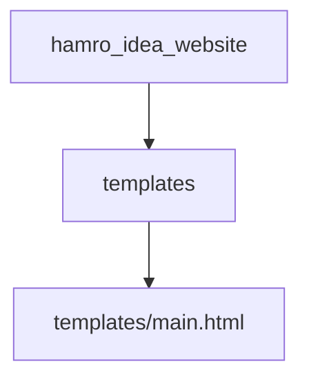
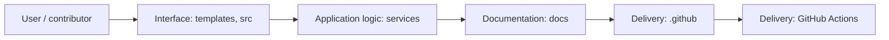
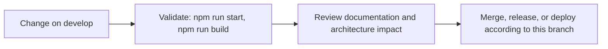

# Hamro Idea Website

<!-- interactive-readme-standard:start -->

> [!NOTE]
> **Branch-specific documentation:** this section is maintained for [`develop`](https://github.com/Nischhalsubba/hamro_idea_website/tree/develop). It is generated from the files present on this branch and preserves the project-authored README below.

<details open>
<summary><strong>Interactive repository guide</strong></summary>

## Branch overview

| Item | Value |
|---|---|
| Repository | [`Nischhalsubba/hamro_idea_website`](https://github.com/Nischhalsubba/hamro_idea_website) |
| Branch | [`develop`](https://github.com/Nischhalsubba/hamro_idea_website/tree/develop) |
| Detected stack | HTML, Sass, JavaScript, CSS |
| Detected manifests | package.json |
| Documentation policy | Every maintained branch must explain purpose, setup, structure, architecture, flows, testing, delivery, security, and ownership. |

## Repository structure

```mermaid
flowchart TD
    ROOT["hamro_idea_website / develop"]
    ROOT --> P0[".agent/"]
    ROOT --> P1[".github/"]
    ROOT --> P2[".vscode/"]
    ROOT --> P3["about/"]
    ROOT --> P4["assets/"]
    ROOT --> P5["contact/"]
    ROOT --> P6["docs/"]
    ROOT --> P7["hamroidea-cms/"]
    ROOT --> P8["insights/"]
    ROOT --> P9["organisms/"]
    ROOT --> P10["process/"]
    ROOT --> P11["services/"]
    ROOT --> P12["src/"]
    ROOT --> P13["templates/"]
    ROOT --> P14["work/"]
    ROOT --> P15[".DS_Store"]
    ROOT --> P16[".editorconfig"]
    ROOT --> P17[".gitignore"]
    ROOT --> MORE["+ 12 more top-level entries"]
```



The diagram is generated from the branch's actual top-level files and directories. Use the branch link above for complete source navigation.

## Website or application structure



## Application and responsibility flow



## Change-to-delivery flow



## README requirements for this branch

- Explain what this branch contains and how it differs from the default branch.
- Keep installation, configuration, usage, testing, deployment, security, support, and license information accurate.
- Document repository, website or application, API, data, authentication, background-job, and deployment flows when they exist.
- Prefer Mermaid diagrams and expandable `<details>` sections for visual navigation.
- Link diagrams and modules to real source paths; never invent missing components.
- Preserve project-specific documentation and update diagrams whenever architecture or major paths change.
- Treat secrets, private infrastructure, customer data, and credentials as prohibited README content.

</details>

<!-- interactive-readme-standard:end -->

A premium, technical marketing website for Hamro Idea - a Nepal-based software and digital delivery studio serving global clients.

---

## Quick Navigation

<details open>
  <summary><strong>Tabs</strong></summary>

  <table>
    <tr>
      <td><strong>README</strong></td>
      <td><a href="STYLEGUIDE.md">Styleguide</a></td>
    </tr>
  </table>
</details>

- **Docs**: [README](#hamro-idea-website) | [STYLEGUIDE.md](STYLEGUIDE.md)
- **Pages**: [Home](index.html) | [Services](services.html) | [Solutions](solutions.html) | [Work](work.html) | [Process](process.html) | [About](about.html) | [Insights](insights.html) | [Contact](contact.html)
- **Styleguide**: [Interactive](styleguide.html) | [Print/PDF](styleguide-print.html) | [Markdown](STYLEGUIDE.md)

> Tip: GitHub does not support real tabs in README. The links above serve as a clean switch between README and the styleguide.

---

## Table of Contents

- [Overview](#overview)
- [Goals](#goals)
- [Features](#features)
- [Information Architecture](#information-architecture)
- [Tech Stack](#tech-stack)
- [Repository Structure](#repository-structure)
- [Development](#development)
- [Scripts](#scripts)
- [SEO + Accessibility](#seo--accessibility)
- [Performance](#performance)
- [Customization](#customization)
- [Deployment](#deployment)
- [Troubleshooting](#troubleshooting)
- [Styleguide](#styleguide)
- [Credits](#credits)

---

## Overview

Hamro Idea positions itself as a premium, technically credible partner for companies and founders with ambitious ideas. The site emphasizes clarity, trust, and performance with modern visuals, structured content, and consistent navigation patterns.

### Audience

- Founders with validated ideas
- Scaling startups and enterprises
- Teams seeking web development, custom CMS, enterprise software, and branding

---

## Goals

1. Communicate trust and technical credibility.
2. Provide comprehensive service and process detail pages.
3. Showcase case studies and results.
4. Maintain a fast, accessible, SEO-friendly front end.

---

## Features

- **Unified mega menus** with consistent layout across navigation.
- **Comprehensive page system**: services, work, process, insights, contact.
- **Micro-interactions**: scroll reveals, hover states, page spinner, back-to-top.
- **Noise texture overlay** for subtle depth.
- **Dedicated styleguide** in HTML, print/PDF, and Markdown.

---

## Information Architecture

### Core Pages

- `index.html` (Home)
- `services.html`
- `solutions.html`
- `work.html`
- `process.html`
- `about.html`
- `insights.html`
- `contact.html`

### Detail Pages

- Services: `services/*.html`
- Work: `work/*.html`
- Process: `process/*.html`
- About: `about/*.html`
- Insights: `insights/*.html`
- Contact: `contact/*.html`
- Legal: `privacy-policy.html`, `terms-of-use.html`, `cookie-consent.html`

---

## Tech Stack

| Layer | Tech | Notes |
| --- | --- | --- |
| Markup | HTML | Static HTML output |
| Styles | CSS | Compiled into `assets/css/main.css` |
| Scripts | JS | Bundled in `assets/js/all.js` + `assets/js/page-ui.js` |
| Build | Gulp | Compiles assets and templates |

---

## Repository Structure

```text
.
├─ index.html
├─ services.html
├─ solutions.html
├─ work.html
├─ process.html
├─ about.html
├─ insights.html
├─ contact.html
├─ services/
├─ work/
├─ process/
├─ about/
├─ insights/
├─ contact/
├─ assets/
│  ├─ css/
│  ├─ js/
│  └─ images/
├─ templates/
├─ organisms/
└─ src/
```

---

## Development

```bash
npm install
npm run start
```

Build production assets:

```bash
npm run build
```

---

## Scripts

- `npm run start` - development build + watch
- `npm run build` - production build

---

## SEO + Accessibility

### SEO rules

- One H1 per page, aligned with primary keyword + location.
- Unique title and meta description per page.
- Internal links from key sections and CTAs.
- Structured headings with H2/H3 hierarchy.

### Accessibility rules

- Visible focus states on all interactive elements.
- Keyboard-friendly navigation and menus.
- Proper semantic HTML (headings, lists, buttons).
- Alt text for meaningful imagery.

---

## Performance

- SVG for icons and UI graphics.
- Optimized hero assets, no heavy media in above-the-fold.
- Limited font weights for faster loading.
- Reduced motion support where necessary.

---

## Customization

- **Navigation**: `templates/main.html`, `organisms/navbar.html`
- **Global styles**: `assets/css/main.css`
- **Page UI interactions**: `assets/js/page-ui.js`
- **Content**: edit HTML files directly per page

---

## Deployment

This is a static website. Deploy the project root to any static host:

- Netlify
- Vercel
- GitHub Pages
- Cloudflare Pages

---

## Troubleshooting

- If a page looks outdated, hard refresh or confirm the correct file was edited.
- If mega menus are missing, sync `templates/main.html` with `organisms/navbar.html`.
- If scroll or overlays behave unexpectedly, check `assets/css/main.css`.

---

## Styleguide

- `styleguide.html` - interactive styleguide
- `styleguide-print.html` - print/PDF styleguide
- `STYLEGUIDE.md` - Markdown documentation

---

## Credits

Designed and conceptualized by Nischhal Raj Subba.
