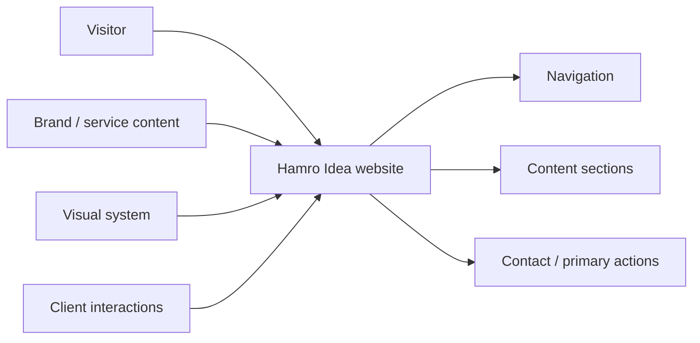
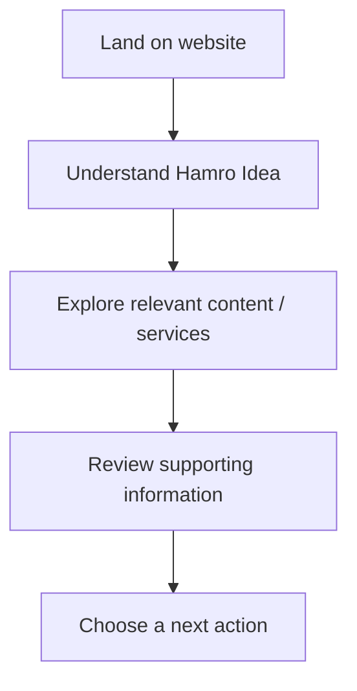
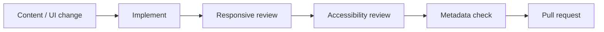

<div align="center">

# Hamro Idea Website

**A responsive website project for presenting the Hamro Idea brand, content, services, and visitor actions through a clear public-facing experience.**


[Browse source](https://github.com/Nischhalsubba/hamro_idea_website/tree/main) · [Issues](https://github.com/Nischhalsubba/hamro_idea_website/issues)

</div>

## Overview

**Hamro Idea Website** is documented so a visitor can understand the public experience while developers, designers, and content owners can understand how pages, presentation, interactions, and content fit together.

<details open>
<summary><strong>🏗️ Interactive website architecture</strong></summary>



</details>

## Visitor flow



## Audience guide

| Audience | Focus |
|---|---|
| Visitors | Clear purpose, useful content and next actions |
| Developers | Structure, behavior, assets and delivery |
| Designers | Hierarchy, responsive layout, interaction states and accessibility |
| Content owners | Accurate copy, links, imagery and metadata |

## Getting started

```bash
git clone https://github.com/Nischhalsubba/hamro_idea_website.git
cd hamro_idea_website
```

Use the manifests and lockfiles committed in the repository to determine the supported runtime and commands.

## Design & accessibility

Keep navigation predictable, mobile layouts resilient, focus visible, contrast readable, images purposeful, and primary actions easy to distinguish. Content structure should remain understandable even without decorative effects.

## SEO & discoverability

Use a clear brand title and description, semantic headings, descriptive internal links, accurate service/content terminology, meaningful image alternatives, canonical metadata, and social-preview tags. Search-oriented copy should describe real Hamro Idea content rather than repeat generic marketing phrases.

## Contribution flow


