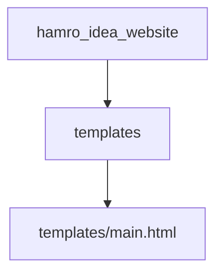
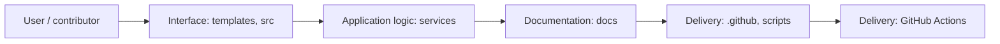
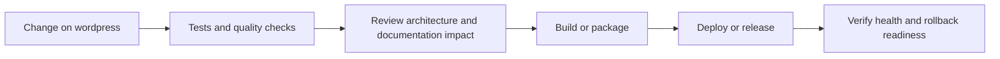
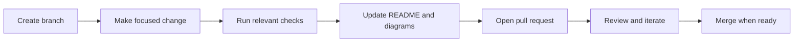

<!-- interactive-readme-standard:start -->

<div align="center">

# hamro_idea_website

**Branch-aware technical guide for [`wordpress`](https://github.com/Nischhalsubba/hamro_idea_website/tree/wordpress)**

<p>       </p>

<p>
  <a href="https://github.com/Nischhalsubba/hamro_idea_website/tree/wordpress"><strong>Browse source</strong></a> ·
  <a href="https://github.com/Nischhalsubba/hamro_idea_website/issues"><strong>Issues</strong></a> ·
  <a href="https://github.com/Nischhalsubba/hamro_idea_website/codespaces/new?ref=wordpress"><strong>Open in Codespaces</strong></a>
</p>

</div>

> [!IMPORTANT]
> This guide is generated from the files actually present on `wordpress`. It links to detected source paths, preserves project-authored notes, and avoids claiming components that were not found.

## At a glance

| Item | Detected value |
|---|---|
| Purpose | Static marketing website for Hamro Idea, a Nepal-based software and digital product studio. |
| Branch role | Compared with `main` |
| Stack | HTML, Sass, JavaScript, PHP, CSS |
| Manifests | package.json |
| Prerequisites | Node.js |
| Delivery | GitHub Actions |
| License | LICENSE |

## Branch scope

This branch differs from the default branch in the following detected paths:

- [`README.md`](https://github.com/Nischhalsubba/hamro_idea_website/blob/wordpress/README.md)
- [`wordpress-theme/hamro-idea/README.md`](https://github.com/Nischhalsubba/hamro_idea_website/blob/wordpress/wordpress-theme/hamro-idea/README.md)
- [`wordpress-theme/hamro-idea/assets/css/main.css`](https://github.com/Nischhalsubba/hamro_idea_website/blob/wordpress/wordpress-theme/hamro-idea/assets/css/main.css)
- [`wordpress-theme/hamro-idea/assets/css/wp-theme.css`](https://github.com/Nischhalsubba/hamro_idea_website/blob/wordpress/wordpress-theme/hamro-idea/assets/css/wp-theme.css)
- [`wordpress-theme/hamro-idea/assets/images/404.png`](https://github.com/Nischhalsubba/hamro_idea_website/blob/wordpress/wordpress-theme/hamro-idea/assets/images/404.png)
- [`wordpress-theme/hamro-idea/assets/images/404.svg`](https://github.com/Nischhalsubba/hamro_idea_website/blob/wordpress/wordpress-theme/hamro-idea/assets/images/404.svg)
- [`wordpress-theme/hamro-idea/assets/images/404/404.svg`](https://github.com/Nischhalsubba/hamro_idea_website/blob/wordpress/wordpress-theme/hamro-idea/assets/images/404/404.svg)
- [`wordpress-theme/hamro-idea/assets/images/404/star.svg`](https://github.com/Nischhalsubba/hamro_idea_website/blob/wordpress/wordpress-theme/hamro-idea/assets/images/404/star.svg)
- [`wordpress-theme/hamro-idea/assets/images/ENVELOPE.svg`](https://github.com/Nischhalsubba/hamro_idea_website/blob/wordpress/wordpress-theme/hamro-idea/assets/images/ENVELOPE.svg)
- [`wordpress-theme/hamro-idea/assets/images/LOCATION.svg`](https://github.com/Nischhalsubba/hamro_idea_website/blob/wordpress/wordpress-theme/hamro-idea/assets/images/LOCATION.svg)
- [`wordpress-theme/hamro-idea/assets/images/Logo-dark.png`](https://github.com/Nischhalsubba/hamro_idea_website/blob/wordpress/wordpress-theme/hamro-idea/assets/images/Logo-dark.png)
- [`wordpress-theme/hamro-idea/assets/images/Logo-white.png`](https://github.com/Nischhalsubba/hamro_idea_website/blob/wordpress/wordpress-theme/hamro-idea/assets/images/Logo-white.png)

## Quick start

```bash
npm install
npm run start
npm run build
```

### Configuration surface

- No committed environment example file was detected.

> Never commit secrets, private keys, production credentials, customer data, or unredacted infrastructure details.

## Repository map

```mermaid
flowchart TD
    ROOT["hamro_idea_website / wordpress"]
    ROOT --> P0[".agent/"]
    ROOT --> P1[".github/"]
    ROOT --> P2["about/"]
    ROOT --> P3["assets/"]
    ROOT --> P4["contact/"]
    ROOT --> P5["docs/"]
    ROOT --> P6["hamroidea-cms/"]
    ROOT --> P7["insights/"]
    ROOT --> P8["organisms/"]
    ROOT --> P9["process/"]
    ROOT --> P10["scripts/"]
    ROOT --> P11["services/"]
    ROOT --> P12["src/"]
    ROOT --> P13["templates/"]
    ROOT --> P14["wordpress-theme/"]
    ROOT --> P15["work/"]
    ROOT --> P16[".DS_Store"]
    ROOT --> P17[".editorconfig"]
    ROOT --> MORE["+ 23 more top-level entries"]
```



| Responsibility | Detected source paths |
|---|---|
| Interface | [`templates`](https://github.com/Nischhalsubba/hamro_idea_website/tree/wordpress/templates), [`src`](https://github.com/Nischhalsubba/hamro_idea_website/tree/wordpress/src) |
| Application logic | [`services`](https://github.com/Nischhalsubba/hamro_idea_website/tree/wordpress/services) |
| Documentation | [`docs`](https://github.com/Nischhalsubba/hamro_idea_website/tree/wordpress/docs) |
| Delivery | [`.github`](https://github.com/Nischhalsubba/hamro_idea_website/tree/wordpress/.github), [`scripts`](https://github.com/Nischhalsubba/hamro_idea_website/tree/wordpress/scripts) |

## Website or application map



## Architecture and responsibility flow




## Quality, security, and operations

<table>
<tr>
<td width="33%" valign="top">

### Quality

- No conventional test directory was detected automatically.

Detected commands:
- `npm run start`
- `npm run build`

</td>
<td width="33%" valign="top">

### Security

- No dedicated security policy or automated dependency configuration was detected.

Review authentication, authorization, input validation, dependency updates, secret handling, and failure recovery before release.

</td>
<td width="34%" valign="top">

### Observability

- No dedicated observability integration was detected automatically.

Define useful logs, metrics, traces, alerts, and rollback signals for production-facing branches.

</td>
</tr>
</table>

## Delivery flow



### Automation detected

- [`.github/workflows/npm_publish.yml`](https://github.com/Nischhalsubba/hamro_idea_website/blob/wordpress/.github/workflows/npm_publish.yml)
- [`.github/workflows/tests.yml`](https://github.com/Nischhalsubba/hamro_idea_website/blob/wordpress/.github/workflows/tests.yml)

## Contribution flow



- Keep changes focused and explain architectural consequences.
- Run the checks relevant to the changed area.
- Update diagrams whenever routes, modules, data models, authentication, jobs, or delivery paths change.
- Add screenshots or recordings for visual behavior changes when useful.
- Use issues for reproducible defects and pull requests for reviewable changes.

## Ownership and support

| Topic | Source |
|---|---|
| Repository | [`Nischhalsubba/hamro_idea_website`](https://github.com/Nischhalsubba/hamro_idea_website) |
| Branch | [`wordpress`](https://github.com/Nischhalsubba/hamro_idea_website/tree/wordpress) |
| Ownership | No CODEOWNERS file detected |
| Contributing | Use the contribution flow above |
| Support | [Open or review issues](https://github.com/Nischhalsubba/hamro_idea_website/issues) |
| License | [`LICENSE`](https://github.com/Nischhalsubba/hamro_idea_website/blob/wordpress/LICENSE) |

<details>
<summary><strong>Documentation maintenance checklist</strong></summary>

- [ ] Purpose and branch scope are accurate.
- [ ] Setup and configuration commands still work.
- [ ] Repository, application, API, data, authentication, job, and deployment diagrams match the code.
- [ ] Tests, security controls, observability, and rollback behavior are documented.
- [ ] Links point to real files on this branch.
- [ ] No secrets or private operational details are exposed.

</details>

<!-- interactive-readme-standard:end -->

<!-- project-authored-notes:start -->
<details>
<summary><strong>Project-authored notes preserved from this branch</strong></summary>

# Hamro Idea Website

Static multi-page marketing website for Hamro Idea, a Nepal-based software, web development, CMS, and digital product studio.

## Overview

Hamro Idea helps startups, local businesses, agencies, growing companies, and enterprise teams design and build high-performing websites, web apps, CMS platforms, eCommerce systems, and custom software.

The site is intentionally static and keeps the existing premium technical visual direction while improving positioning, navigation, SEO, conversion paths, and maintainability.

## Business Purpose

- Communicate Hamro Idea as a credible Nepal-based software and web studio.
- Make services easier to understand within the first few seconds.
- Route visitors to overview pages, detailed services, selected work, process, and project inquiry paths.
- Avoid fake metrics, client claims, testimonials, awards, or placeholder social links.

## Tech Stack

- HTML and Pug templates
- SCSS compiled to CSS
- JavaScript bundled through Gulp, Babel, and webpack-stream
- BrowserSync for local development
- Static assets in `assets/`
- Source files in `src/`

## Page Structure

- `index.html` - homepage
- `services.html` - service overview
- `solutions.html` - solution paths
- `work.html` - selected work overview
- `process.html` - delivery process
- `about.html` - studio overview
- `insights.html` - articles and resources
- `contact.html` - contact options
- `services/*.html` - service detail pages
- `work/*.html`, `process/*.html`, `about/*.html`, `insights/*.html`, `contact/*.html` - detail pages
- `privacy-policy.html`, `terms-of-use.html`, `cookie-consent.html` - legal pages
- `404.html`, `robots.txt`, `sitemap.xml` - QA and SEO support files

## Setup

```bash
npm install
npm run start
```

`npm run start` runs the Gulp build, starts BrowserSync, and watches source files.

## Build

```bash
npm run build
```

The current workflow writes production files to the repository root to preserve existing static hosting and asset paths. The `clear` task only removes generated asset folders and bundled files; it does not delete root HTML files.

For Vercel, `npm run build` also prepares a `public/` directory after Gulp finishes. Vercel should use:

- Build Command: `npm run build`
- Output Directory: `public`

## Deployment

Deploy the repository root as a static site after running:

```bash
npm install
npm run build
```

Confirm the hosting platform serves:

- `/index.html`
- `/services.html`
- `/sitemap.xml`
- `/robots.txt`
- `/404.html`

## Design System

The visual direction is documented in `STYLEGUIDE.md`.

Key direction:

- premium technical feel
- navy and indigo as trust/action colors
- magenta and gold only as small highlights
- consistent cards, spacing, buttons, CTAs, and focus states
- reduced-motion support where animation is used

## SEO Notes

- Homepage metadata targets web development, custom software, and digital product studio positioning in Nepal.
- Overview pages have unique titles, descriptions, canonicals, Open Graph tags, and Twitter card tags.
- Placeholder social URLs were removed from schema and footer links.
- `robots.txt` and `sitemap.xml` are included in source and root output.

## Accessibility Notes

- Skip link is present.
- Navigation uses semantic links and buttons.
- Focus and hover states are preserved through the shared UI system.
- Detail pages include breadcrumbs.
- Mobile navigation and card stacking should be checked visually after major content edits.

## Quality Checks

Run before deployment:

```bash
npm install
npm run build
```

Recommended manual checks:

- homepage first impression and CTA clarity
- mobile navigation
- project form spacing and helper copy
- service detail page scanability
- footer and legal links
- analytics/form backend integration

## Roadmap

- Connect the project form to a real backend or verified Formspree endpoint.
- Replace placeholder project imagery and generic project highlights with real selected work.
- Add automated link checking and HTML validation to CI.
- Add a GitHub Actions build check.
- Expand service detail pages from static sections into source templates.
- Add richer case studies once real client-approved proof is available.

## Credits

Designed and developed for Hamro Idea by Nischhal Raj Subba.

</details>
<!-- project-authored-notes:end -->
