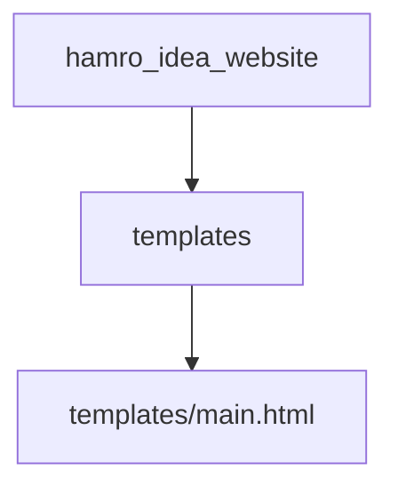
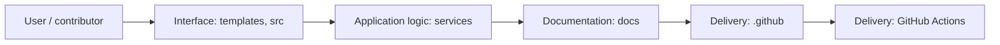
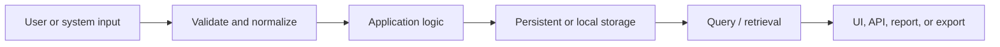
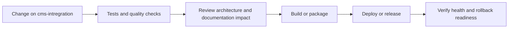
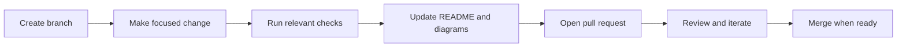

<!-- interactive-readme-standard:start -->

<div align="center">

# hamro_idea_website

**Branch-aware technical guide for [`cms-intregration`](https://github.com/Nischhalsubba/hamro_idea_website/tree/cms-intregration)**

<p>       </p>

<p>
  <a href="https://github.com/Nischhalsubba/hamro_idea_website/tree/cms-intregration"><strong>Browse source</strong></a> ·
  <a href="https://github.com/Nischhalsubba/hamro_idea_website/issues"><strong>Issues</strong></a> ·
  <a href="https://github.com/Nischhalsubba/hamro_idea_website/codespaces/new?ref=cms-intregration"><strong>Open in Codespaces</strong></a>
</p>

</div>

> [!IMPORTANT]
> This guide is generated from the files actually present on `cms-intregration`. It links to detected source paths, preserves project-authored notes, and avoids claiming components that were not found.

## At a glance

| Item | Detected value |
|---|---|
| Purpose | A simple Gulp 4 Starter Kit for modern web development. |
| Branch role | Compared with `main` |
| Stack | HTML, Sass, TypeScript, JavaScript, CSS |
| Manifests | package.json |
| Prerequisites | Node.js |
| Delivery | GitHub Actions |
| License | LICENSE |

## Branch scope

This branch differs from the default branch in the following detected paths:

- [`README.md`](https://github.com/Nischhalsubba/hamro_idea_website/blob/cms-intregration/README.md)
- [`hamroidea-cms/.env.example`](https://github.com/Nischhalsubba/hamro_idea_website/blob/cms-intregration/hamroidea-cms/.env.example)
- [`hamroidea-cms/.gitignore`](https://github.com/Nischhalsubba/hamro_idea_website/blob/cms-intregration/hamroidea-cms/.gitignore)
- [`hamroidea-cms/README.md`](https://github.com/Nischhalsubba/hamro_idea_website/blob/cms-intregration/hamroidea-cms/README.md)
- [`hamroidea-cms/config/admin.ts`](https://github.com/Nischhalsubba/hamro_idea_website/blob/cms-intregration/hamroidea-cms/config/admin.ts)
- [`hamroidea-cms/config/api.ts`](https://github.com/Nischhalsubba/hamro_idea_website/blob/cms-intregration/hamroidea-cms/config/api.ts)
- [`hamroidea-cms/config/database.ts`](https://github.com/Nischhalsubba/hamro_idea_website/blob/cms-intregration/hamroidea-cms/config/database.ts)
- [`hamroidea-cms/config/middlewares.ts`](https://github.com/Nischhalsubba/hamro_idea_website/blob/cms-intregration/hamroidea-cms/config/middlewares.ts)
- [`hamroidea-cms/config/plugins.ts`](https://github.com/Nischhalsubba/hamro_idea_website/blob/cms-intregration/hamroidea-cms/config/plugins.ts)
- [`hamroidea-cms/config/server.ts`](https://github.com/Nischhalsubba/hamro_idea_website/blob/cms-intregration/hamroidea-cms/config/server.ts)
- [`hamroidea-cms/database/migrations/.gitkeep`](https://github.com/Nischhalsubba/hamro_idea_website/blob/cms-intregration/hamroidea-cms/database/migrations/.gitkeep)
- [`hamroidea-cms/favicon.png`](https://github.com/Nischhalsubba/hamro_idea_website/blob/cms-intregration/hamroidea-cms/favicon.png)

## Quick start

```bash
npm install
npm run start
npm run build
```

### Configuration surface

- `hamroidea-cms/.env.example`

> Never commit secrets, private keys, production credentials, customer data, or unredacted infrastructure details.

## Repository map

```mermaid
flowchart TD
    ROOT["hamro_idea_website / cms-intregration"]
    ROOT --> P0[".agent/"]
    ROOT --> P1[".github/"]
    ROOT --> P2["about/"]
    ROOT --> P3["assets/"]
    ROOT --> P4["contact/"]
    ROOT --> P5["docs/"]
    ROOT --> P6["hamroidea-cms/"]
    ROOT --> P7["insights/"]
    ROOT --> P8["organisms/"]
    ROOT --> P9["process/"]
    ROOT --> P10["services/"]
    ROOT --> P11["skills/"]
    ROOT --> P12["src/"]
    ROOT --> P13["templates/"]
    ROOT --> P14["work/"]
    ROOT --> P15[".DS_Store"]
    ROOT --> P16[".editorconfig"]
    ROOT --> P17[".gitignore"]
    ROOT --> MORE["+ 20 more top-level entries"]
```



| Responsibility | Detected source paths |
|---|---|
| Interface | [`templates`](https://github.com/Nischhalsubba/hamro_idea_website/tree/cms-intregration/templates), [`src`](https://github.com/Nischhalsubba/hamro_idea_website/tree/cms-intregration/src) |
| Application logic | [`services`](https://github.com/Nischhalsubba/hamro_idea_website/tree/cms-intregration/services) |
| Documentation | [`docs`](https://github.com/Nischhalsubba/hamro_idea_website/tree/cms-intregration/docs) |
| Delivery | [`.github`](https://github.com/Nischhalsubba/hamro_idea_website/tree/cms-intregration/.github) |

## Website or application map



## Architecture and responsibility flow



<details>
<summary><strong>Data flow and model surface</strong></summary>



Detected data areas: [`skills/strapi-migration/SKILL.md`](https://github.com/Nischhalsubba/hamro_idea_website/blob/cms-intregration/skills/strapi-migration/SKILL.md), [`hamroidea-cms/config/database.ts`](https://github.com/Nischhalsubba/hamro_idea_website/blob/cms-intregration/hamroidea-cms/config/database.ts), [`hamroidea-cms/database/migrations/.gitkeep`](https://github.com/Nischhalsubba/hamro_idea_website/blob/cms-intregration/hamroidea-cms/database/migrations/.gitkeep).

</details>

## Quality, security, and operations

<table>
<tr>
<td width="33%" valign="top">

### Quality

- No conventional test directory was detected automatically.

Detected commands:
- `npm run start`
- `npm run build`

</td>
<td width="33%" valign="top">

### Security

- No dedicated security policy or automated dependency configuration was detected.

Review authentication, authorization, input validation, dependency updates, secret handling, and failure recovery before release.

</td>
<td width="34%" valign="top">

### Observability

- No dedicated observability integration was detected automatically.

Define useful logs, metrics, traces, alerts, and rollback signals for production-facing branches.

</td>
</tr>
</table>

## Delivery flow



### Automation detected

- [`.github/workflows/npm_publish.yml`](https://github.com/Nischhalsubba/hamro_idea_website/blob/cms-intregration/.github/workflows/npm_publish.yml)
- [`.github/workflows/tests.yml`](https://github.com/Nischhalsubba/hamro_idea_website/blob/cms-intregration/.github/workflows/tests.yml)

## Contribution flow



- Keep changes focused and explain architectural consequences.
- Run the checks relevant to the changed area.
- Update diagrams whenever routes, modules, data models, authentication, jobs, or delivery paths change.
- Add screenshots or recordings for visual behavior changes when useful.
- Use issues for reproducible defects and pull requests for reviewable changes.

## Ownership and support

| Topic | Source |
|---|---|
| Repository | [`Nischhalsubba/hamro_idea_website`](https://github.com/Nischhalsubba/hamro_idea_website) |
| Branch | [`cms-intregration`](https://github.com/Nischhalsubba/hamro_idea_website/tree/cms-intregration) |
| Ownership | No CODEOWNERS file detected |
| Contributing | Use the contribution flow above |
| Support | [Open or review issues](https://github.com/Nischhalsubba/hamro_idea_website/issues) |
| License | [`LICENSE`](https://github.com/Nischhalsubba/hamro_idea_website/blob/cms-intregration/LICENSE) |

<details>
<summary><strong>Documentation maintenance checklist</strong></summary>

- [ ] Purpose and branch scope are accurate.
- [ ] Setup and configuration commands still work.
- [ ] Repository, application, API, data, authentication, job, and deployment diagrams match the code.
- [ ] Tests, security controls, observability, and rollback behavior are documented.
- [ ] Links point to real files on this branch.
- [ ] No secrets or private operational details are exposed.

</details>

<!-- interactive-readme-standard:end -->

<!-- project-authored-notes:start -->
<details>
<summary><strong>Project-authored notes preserved from this branch</strong></summary>

# Hamro Idea Website

A premium, technical marketing website for Hamro Idea - a Nepal-based software and digital delivery studio serving global clients.

---

## Quick Navigation

<details open>
  <summary><strong>Tabs</strong></summary>

  <table>
    <tr>
      <td><strong>README</strong></td>
      <td><a href="STYLEGUIDE.md">Styleguide</a></td>
    </tr>
  </table>
</details>

- **Docs**: [README](#hamro-idea-website) | [STYLEGUIDE.md](STYLEGUIDE.md)
- **Pages**: [Home](index.html) | [Services](services.html) | [Solutions](solutions.html) | [Work](work.html) | [Process](process.html) | [About](about.html) | [Insights](insights.html) | [Contact](contact.html)
- **Styleguide**: [Interactive](styleguide.html) | [Print/PDF](styleguide-print.html) | [Markdown](STYLEGUIDE.md)

> Tip: GitHub does not support real tabs in README. The links above serve as a clean switch between README and the styleguide.

---

## Table of Contents

- [Overview](#overview)
- [Goals](#goals)
- [Features](#features)
- [Information Architecture](#information-architecture)
- [Tech Stack](#tech-stack)
- [Repository Structure](#repository-structure)
- [Development](#development)
- [Scripts](#scripts)
- [SEO + Accessibility](#seo--accessibility)
- [Performance](#performance)
- [Customization](#customization)
- [Deployment](#deployment)
- [Troubleshooting](#troubleshooting)
- [Styleguide](#styleguide)
- [Credits](#credits)

---

## Overview

Hamro Idea positions itself as a premium, technically credible partner for companies and founders with ambitious ideas. The site emphasizes clarity, trust, and performance with modern visuals, structured content, and consistent navigation patterns.

### Audience

- Founders with validated ideas
- Scaling startups and enterprises
- Teams seeking web development, custom CMS, enterprise software, and branding

---

## Goals

1. Communicate trust and technical credibility.
2. Provide comprehensive service and process detail pages.
3. Showcase case studies and results.
4. Maintain a fast, accessible, SEO-friendly front end.

---

## Features

- **Unified mega menus** with consistent layout across navigation.
- **Comprehensive page system**: services, work, process, insights, contact.
- **Micro-interactions**: scroll reveals, hover states, page spinner, back-to-top.
- **Noise texture overlay** for subtle depth.
- **Dedicated styleguide** in HTML, print/PDF, and Markdown.

---

## Information Architecture

### Core Pages

- `index.html` (Home)
- `services.html`
- `solutions.html`
- `work.html`
- `process.html`
- `about.html`
- `insights.html`
- `contact.html`

### Detail Pages

- Services: `services/*.html`
- Work: `work/*.html`
- Process: `process/*.html`
- About: `about/*.html`
- Insights: `insights/*.html`
- Contact: `contact/*.html`
- Legal: `privacy-policy.html`, `terms-of-use.html`, `cookie-consent.html`

---

## Tech Stack

| Layer | Tech | Notes |
| --- | --- | --- |
| Markup | HTML | Static HTML output |
| Styles | CSS | Compiled into `assets/css/main.css` |
| Scripts | JS | Bundled in `assets/js/all.js` + `assets/js/page-ui.js` |
| Build | Gulp | Compiles assets and templates |

---

## Repository Structure

```text
.
├─ index.html
├─ services.html
├─ solutions.html
├─ work.html
├─ process.html
├─ about.html
├─ insights.html
├─ contact.html
├─ services/
├─ work/
├─ process/
├─ about/
├─ insights/
├─ contact/
├─ assets/
│  ├─ css/
│  ├─ js/
│  └─ images/
├─ templates/
├─ organisms/
└─ src/
```

---

## Development

```bash
npm install
npm run start
```

Build production assets:

```bash
npm run build
```

---

## Scripts

- `npm run start` - development build + watch
- `npm run build` - production build

---

## SEO + Accessibility

### SEO rules

- One H1 per page, aligned with primary keyword + location.
- Unique title and meta description per page.
- Internal links from key sections and CTAs.
- Structured headings with H2/H3 hierarchy.

### Accessibility rules

- Visible focus states on all interactive elements.
- Keyboard-friendly navigation and menus.
- Proper semantic HTML (headings, lists, buttons).
- Alt text for meaningful imagery.

---

## Performance

- SVG for icons and UI graphics.
- Optimized hero assets, no heavy media in above-the-fold.
- Limited font weights for faster loading.
- Reduced motion support where necessary.

---

## Customization

- **Navigation**: `templates/main.html`, `organisms/navbar.html`
- **Global styles**: `assets/css/main.css`
- **Page UI interactions**: `assets/js/page-ui.js`
- **Content**: edit HTML files directly per page

---

## Deployment

This is a static website. Deploy the project root to any static host:

- Netlify
- Vercel
- GitHub Pages
- Cloudflare Pages

---

## Troubleshooting

- If a page looks outdated, hard refresh or confirm the correct file was edited.
- If mega menus are missing, sync `templates/main.html` with `organisms/navbar.html`.
- If scroll or overlays behave unexpectedly, check `assets/css/main.css`.

---

## Styleguide

- `styleguide.html` - interactive styleguide
- `styleguide-print.html` - print/PDF styleguide
- `STYLEGUIDE.md` - Markdown documentation

---

## Credits

Designed and conceptualized by Nischhal Raj Subba.

</details>
<!-- project-authored-notes:end -->
