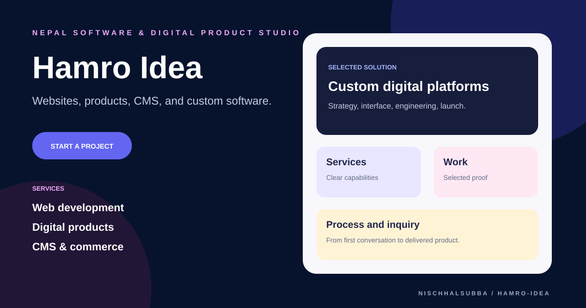

# Hamro Idea Repository Overview

## Classification

Multi-page static marketing website for a Nepal-based software and digital-product studio.

- Source: Pug, SCSS, JavaScript, Gulp, Babel, webpack-stream
- Output: static root files and Vercel `public/` preparation
- Pages: services, solutions, work, process, about, insights, contact, legal, and detail pages
- Fresh screenshot: not captured because public hosts could not be resolved
- Visual above: original repository thumbnail, not a browser screenshot

## Highest-priority checks

1. Run the documented Gulp production build.
2. Confirm root and `public/` outputs stay consistent.
3. Connect the project enquiry form to a verified backend.
4. Replace generic work examples with approved case studies.
5. Add automated HTML, link, accessibility, and build checks.